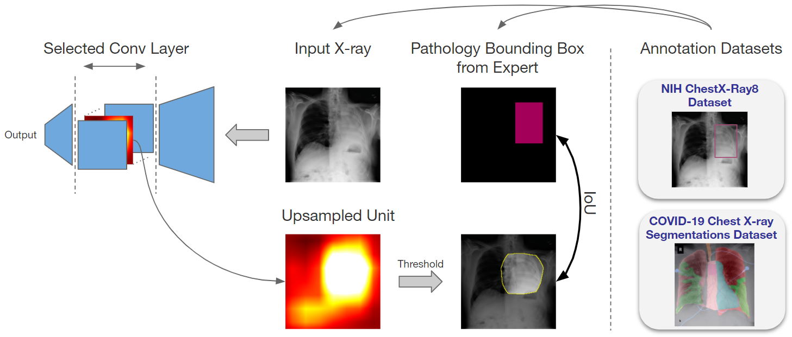
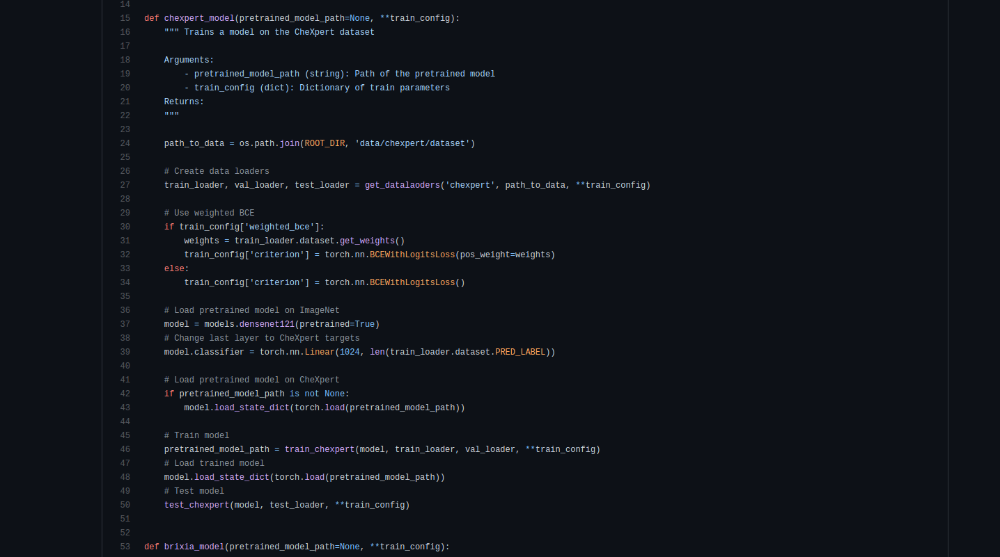

#### In a nutshell
* For COVID-19 and Thoracic pathology neural network classification/regression models, we first identify the concepts (e.g. pathologies) associated with internal units (feature maps) of the network

  We investigate the following questions:
* Does a regression model that is only trained with COVID-19 severity scores implicitly learn visual patterns associated with thoracic pathologies?
* Does a network that is trained on weakly labeled data (e.g. healthy, unhealthy) implicitly learn pathologies (e.g. Consolidation)?

* We also investigate the effect of pretraining and data imbalance on the interpretability of learned features




#### Resources
View the paper on **[arXiv](https://arxiv.org/abs/2104.02481)**
(The camera-ready version will appear in the proceedings of MICCAI 2021.)

Check the [Code on GitHub](https://github.com/CAMP-eXplain-AI/CheXplain-Dissection)
[](https://github.com/CAMP-eXplain-AI/CheXplain-Dissection)

#### Citation
Please cite the work using the below BibTeX (also available on the Open Access link above)
``` bash
@misc{khakzar2021semantic,
      title={Towards Semantic Interpretation of Thoracic Disease and COVID-19 Diagnosis Models}, 
      author={Ashkan Khakzar and Sabrina Musatian and Jonas Buchberger and Icxel Valeriano Quiroz and Nikolaus Pinger and Soroosh Baselizadeh and Seong Tae Kim and Nassir Navab},
      year={2021},
      eprint={2104.02481},
      archivePrefix={arXiv},
      primaryClass={eess.IV}
}
```

#### Contact
For inquiries and feedback please contact Ashkan Khakzar (ashkan.khakzar@tum.de). We would be happy to help and we appreciate your feedback.
